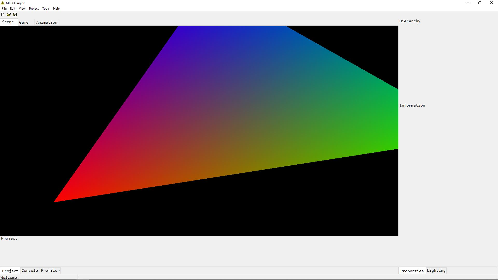

# ML_3D

## June 21, 2019

I decided the [Rastertek](http://www.rastertek.com) tutorial was a great start and provided the best productivity over time in learning to implement rendering with directX into my engine. I started following the series and bringing it into the existing codebase nearly as is from the tutorial for the time being. I'm genuinely interested in following the tutorials as fast as possible for the next couple weeks and then adjusting it as I see fit after I understand the concepts better. 

It is greatly documented and commented consistently throughout the tutorial. It provides more information in comparison to other tutorials such as [DirectX Game Engine Programming](https://www.3dgep.com/introduction-to-directx-11/) and [DirectXTK Intro](https://github.com/microsoft/DirectXTK/wiki/Getting-Started), in my opinion, but not too much to bog me down until I can get a better foundation to tackle heavier reads on rendering such as [Real-Time Rendering](http://www.realtimerendering.com/).

## About
**ML_3D** is ~~the memest engine alive~~ my latest project created for learning purposes by [MonsterLock](https://github.com/MonsterLock). The intention of this project is to further development and knowledge in:
- Engine Development
- Intermediate/Advanced C++
- Fundamentals of Computer Graphics

## [Documentation](Documentation)
- [Updates](Documentation/UPDATES.md) provide the latest modifications/additions.
- [Resources](Documentation/RESOURCES.md) that help establish or even inspire this codebase.
